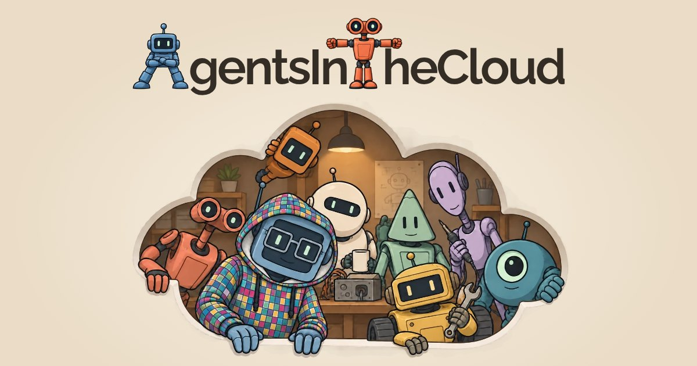

<p align="center">
  <a href="https://agentsinthecloud.com/">
    
  </a>
</p>

- Run cloud coding agents on your own server
- Use any model provider you want
- Workflows optimized for evaluating agent work
- Free, [MIT licensed](LICENSE)

<p align="center">
  <a href="https://agentsinthecloud.com/">Website</a> · <a href="#installation">Install AgentsInTheCloud</a> · <a href="#contributing">Contributing</a>
</p>

## Installation

1. **Connect to your server.** SSH into a Linux server that will only be used for AgentsInTheCloud.
2. **Install AgentsInTheCloud.** Run:

   ```sh
   curl -fsSL https://agentsinthecloud.com/install.sh | bash
   ```

## Contributing

I'm still figuring out how to accept contributions.

I would love to hear how the product could be made better for your use case. In your human voice, not your AI's. Your description can include some AI-generated extra detail, sure, but the main thing you're trying to tell me should be *you* trying to tell *me*.

For now, please don't send pull requests. Telling me exactly how the product could be better for you is very welcome, though. Think of it as a PR in the form of a prompt.

We're all just figuring out this new world in real time :-). Hope you like the product, I had a lot of fun building it.
